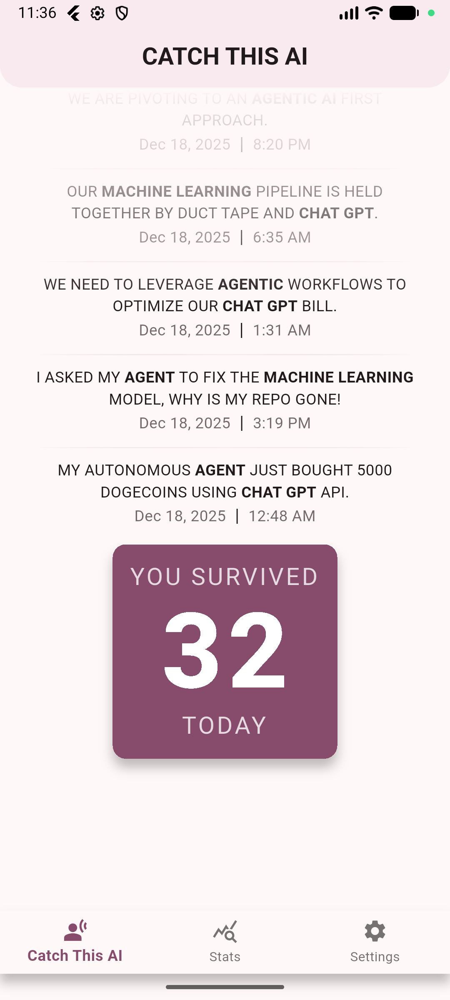
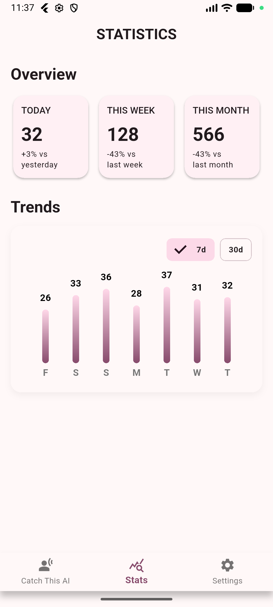
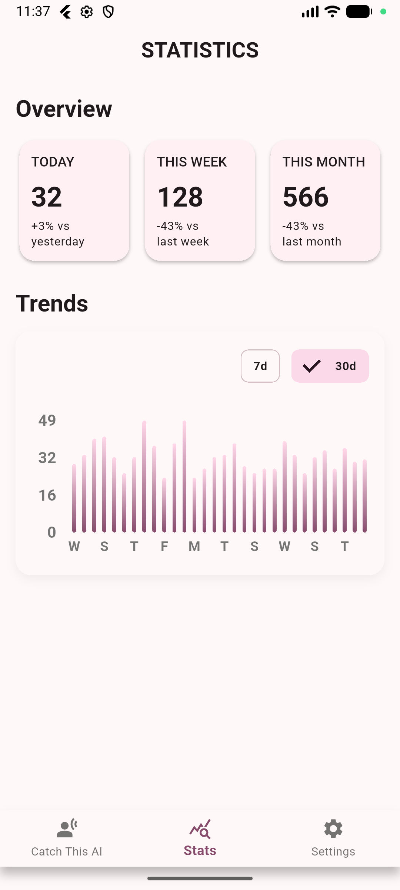
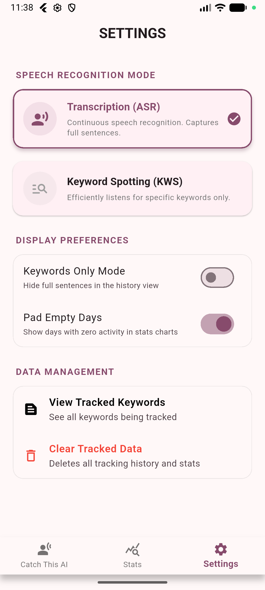
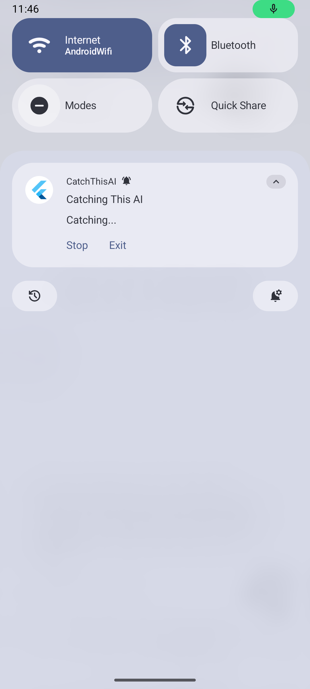

# CatchThisAI

**Tired of hearing about 'AI' every two seconds? See how many times you've survived the AI overload!**

 

 

---

## Preview

  
  
  

  
  

---

## Features
* 🎯 **Instant Buzzword Detection**: Launches in listening mode and catches the AI words you're sick of hearing. The buzzword list can't be modified currently but can be found [here](./assets/sherpa-onnx-kws-zipformer-gigaspeech-3.3M-2024-01-01.keywords_raw.txt).

* 👻 **Backgorund Tracking**: Runs silently in the background while you are using other apps or when screen is locked to keep you hunting for those AI buzzwords.

* 📊 **Charts & Stats**: Analyze how much AI non-sense you had to listen to.

* 🔔 **Persistent Notification**: Persistent notification while app is running with the ability to `pause`, `resume`, and `stop` the AI catching.

* 🔒 **Privacy**: CatchThisAI is completely offline with no data being collected.

---

## For Developers
* **First**
    * Download assets using `./scripts/setup_assets.sh` or equivalent ways of running the bash script.
    * To update keywords, edit the main `.txt` files in [assets/](./assets/) then run `./scripts/setup_assets.sh`

* **Current Behavior** 
    * On start, app launches in [**ASR** mode](./lib/core/services/speech/asr/sherpa_asr_service.dart) and will listen for [keywords](./assets/sherpa-onnx-streaming-zipformer-bilingual-zh-en-2023-02-20.keywords_raw.txt) and show a `persistent/sticky` notification indicating so.
    * Main page shows daily stats only.
    * `persistent/sticky` notification has buttons for control including `start`, `stop`, `resume` and `exit`. 
    * When app is removed from recent apps stack `"swiped up"`, the whole app shut and no more recording is happening.
    * App doesn't start on device start up, but if open, will survive app `update/reinstalls`.

* **DONE**
    * Logic for audio processing using [`record`](https://pub.dev/packages/record)
    * **KeywordSpotting** (KWS) using `sherpa onnx`, **OnlineRecognizer** (ASR) option using `sherpa onnx`
    * Simple UI
    * Runs in the background (as long as app is open in the background)
    * Detects keywords in this `keywords.txt` file of [both models](./assets/)
    * Spotted "texts" are published as the [`TrackedText`](./lib/core/domain/tracked_text.dart) in the form {String text, List<String> keywords, DateTime timestamp} and saved in the [`Hive`](./lib/core/storage/db/db_manager.dart) database
    * In the case of [**KWS**](./lib/core/services/speech/kws/sherpa_kws_service.dart), `keywords` of **TrackedText** is a list with single element, the same as, `text`
    * Home page keeps track of counts of keyword daily
    * Apps runs in the background
    * Included Stats Page
    * Included Settings Page (Choose ASR vs KWS, display options, clear database, etc.)

* **TODO**
    * Polish UI/UX
    * See TODOs in files
    * Cannot run in linux because of `recorder`, see `pubspec.yaml`
    * Think about trimming database box sizes after certain limit to prevent infinite growth (Do we rly need really old data?)
    * Padding values, spacing in charts, etc are hardcoded numbers, shouldn't be like that

